<!-- ============================================================ -->
<!--  HERO IMAGE — docs/banner.svg is a generated placeholder.    -->
<!--  Swap it for a real screenshot: run the app, capture a       -->
<!--  screen, and drop it into a browser mockup (Screenshot.rocks -->
<!--  / KromaStudio) for a polished look, then save it over       -->
<!--  docs/banner.svg (or point this src at a new file).          -->
<!-- ============================================================ -->
<p align="center">
  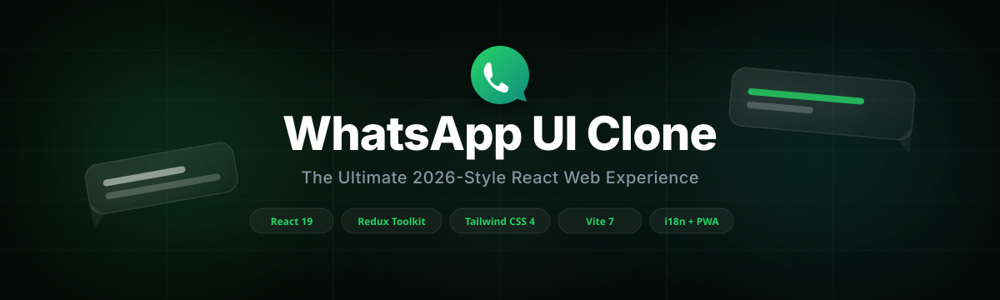
</p>

<h1 align="center">WhatsApp UI Clone</h1>

<p align="center">
  A deep, pixel-close clone of WhatsApp Web — built with React 19, Redux Toolkit,
  and Tailwind CSS. Chats, Status, Communities, Calls, Linked Devices and a full
  Settings suite, all wired together with realistic, local mock data.
</p>

<p align="center">
  <strong>🌍 Live Demo:</strong> <a href="https://wa-ui-clone-v1.netlify.app/">wa-ui-clone-v1.netlify.app</a>
</p>

<p align="center">
  
  
  
  
  
  
</p>

### <u>Table of Contents</u>

- [About](#about)
- [Features](#features)
  - [💬 Chats](docs/features/chats.md)
  - [📸 Status & Channels](docs/features/status-and-channels.md)
  - [📞 Calls](docs/features/calls.md)
  - [👥 Communities](docs/features/communities.md)
  - [⚙️ Settings](docs/features/settings.md)
  - [🧩 Platform](docs/features/platform.md)
- [Tech Stack](#tech-stack)
- [UI Showcase](#ui-showcase)
  - [Interactive gallery](docs/gallery.html)
- [Getting Started](#getting-started)
  - [Prerequisites](#prerequisites)
  - [Installation](#installation)
  - [Running locally](#running-locally)
  - [Building for production](#building-for-production)
- [Project Structure](#project-structure)
- [Architecture Notes](#architecture-notes)

- [Contributing](#contributing)
- [Disclaimer](#disclaimer)
- [License](#license)
- [Author](#author)

---

### <u>About</u>

This project recreates the WhatsApp Web experience in real depth — not just the look,
but the interactions: rich message types, starred/kept messages, custom chat lists,
linked devices, scheduled calls, community management, and a settings suite with
real privacy controls, chat themes and wallpapers. Everything runs on a realistic local
mock dataset (1,200+ lines of contacts, chats, messages, statuses, channels and
communities), so it's a solid reference for React architecture and state management
at the scale of a genuinely large, multi-feature UI.

### <u>Features</u>

WhatsApp Clone covers six feature areas in depth — each one documented on its own page:

| Area | What's inside | Details |
|---|---|---|
| 💬 **Chats** | Rich message types, starred/kept messages, custom Lists, search, broadcast | [docs/features/chats.md](docs/features/chats.md) |
| 📸 **Status & Channels** | Story-style status, channels, explorer | [docs/features/status-and-channels.md](docs/features/status-and-channels.md) |
| 📞 **Calls** | History, favorites, scheduled calls, call links | [docs/features/calls.md](docs/features/calls.md) |
| 👥 **Communities** | Create/manage communities, announcements, sub-groups | [docs/features/communities.md](docs/features/communities.md) |
| ⚙️ **Settings** | Linked devices, privacy, chat appearance, and more | [docs/features/settings.md](docs/features/settings.md) |
| 🧩 **Platform** | Theming, i18n + RTL, PWA, notifications, virtualization | [docs/features/platform.md](docs/features/platform.md) |

> **Known placeholders (by design):** the "AI" tab, switching between multiple accounts,
> and adding participants to an *existing* group each currently show a "coming soon"
> notice in the UI rather than being fully wired up — noted on the relevant page above too.

### <u>Tech Stack</u>

| Layer | Technology |
|---|---|
| UI library | React 19 |
| Build tool | Vite 7 |
| State management | Redux Toolkit + React Redux (fully migrated — no legacy store) |
| Styling | Tailwind CSS 4 |
| Animation | Framer Motion |
| Icons | Lucide React |
| Virtualization | TanStack Virtual |
| Internationalization | Custom i18n config with RTL support |
| Persistence | `localStorage` for theme mode and language preference |
| Tooling | ESLint (React + hooks rules), TypeScript config for JS/JSX tooling (`checkJs` off — not enforcing types yet), PostCSS/Autoprefixer |

### <u>UI Showcase</u>

<details open>
<summary><strong>🌙 Dark Mode</strong></summary>

<p align="center">
  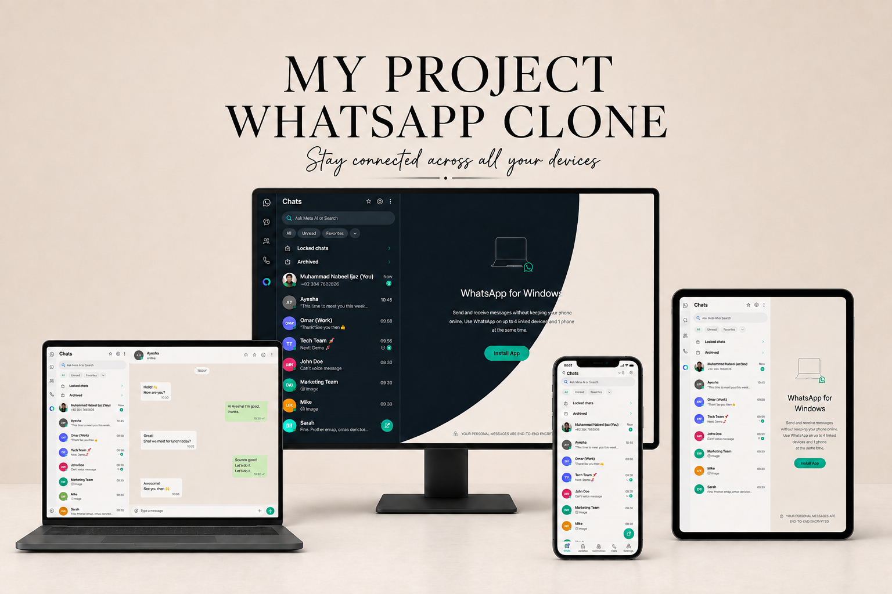&nbsp;&nbsp;
  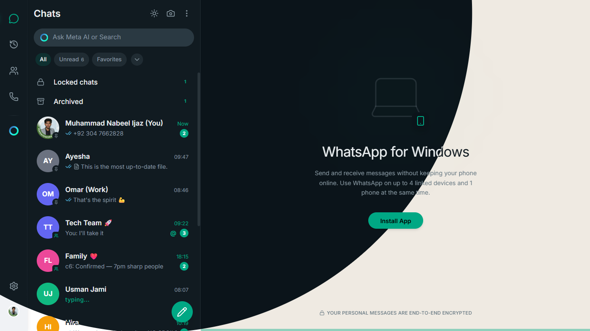&nbsp;&nbsp;
  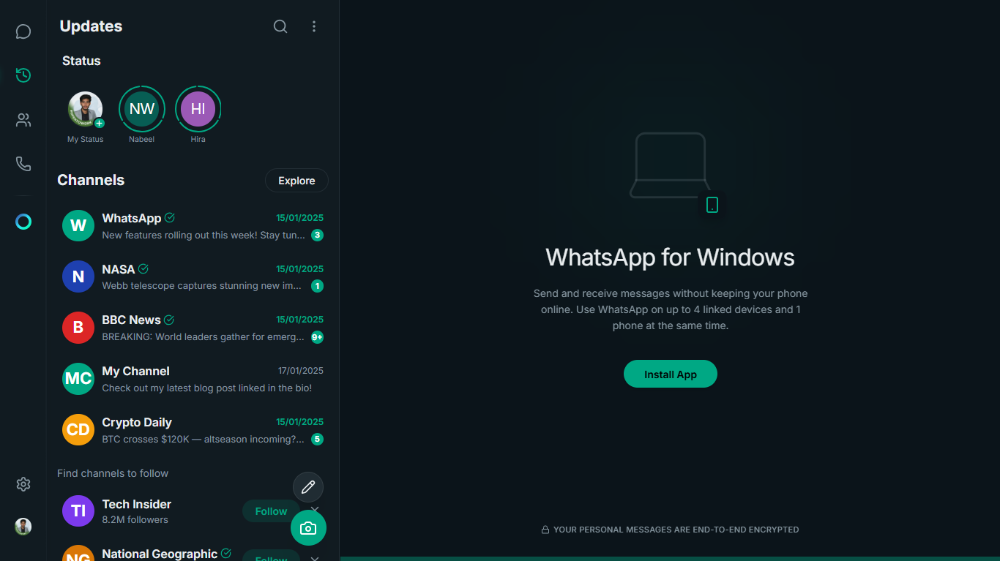&nbsp;&nbsp;
  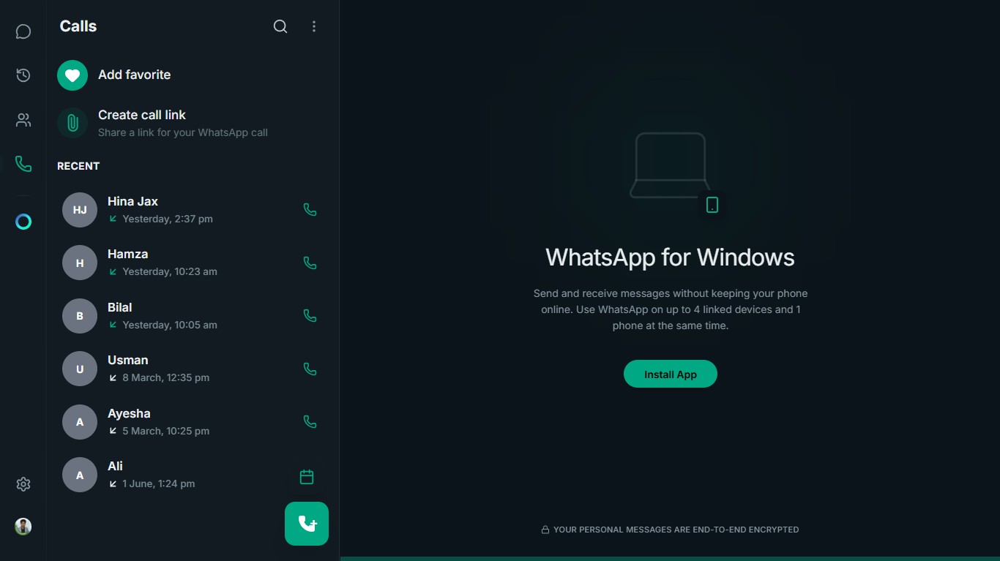
</p>
<p align="center">
  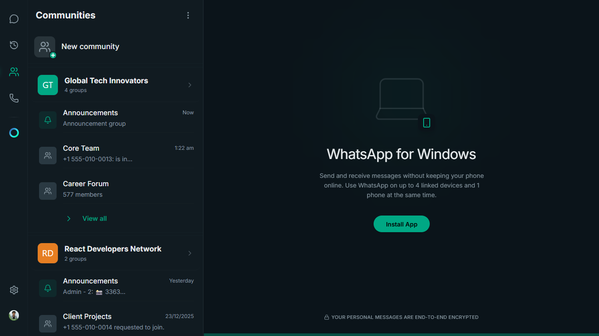&nbsp;&nbsp;
  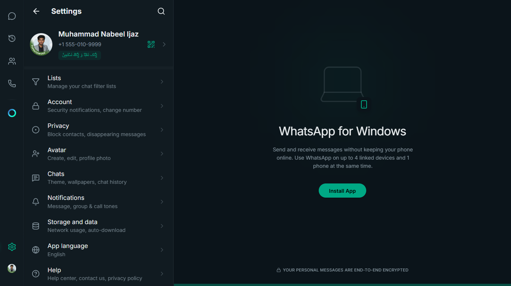&nbsp;&nbsp;
  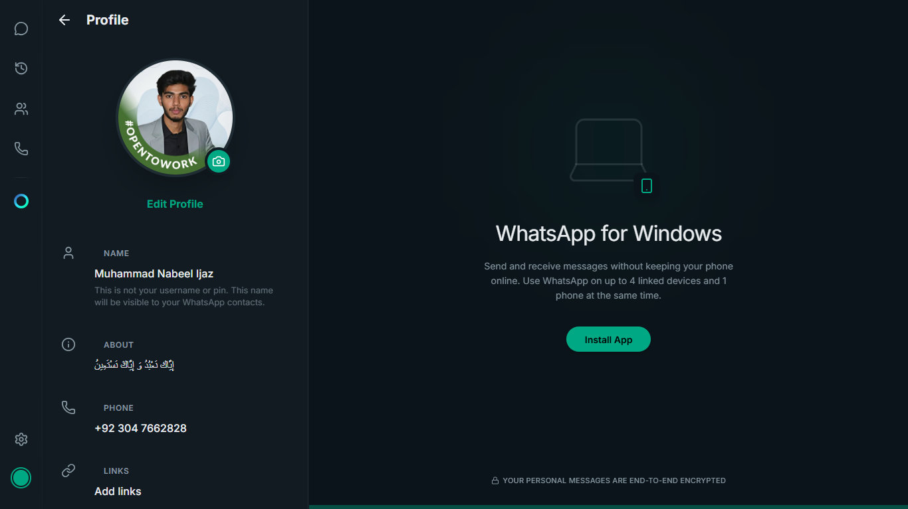
</p>
</details>

<details open>
<summary><strong>☀️ Light Mode</strong></summary>

<p align="center">
  &nbsp;&nbsp;
  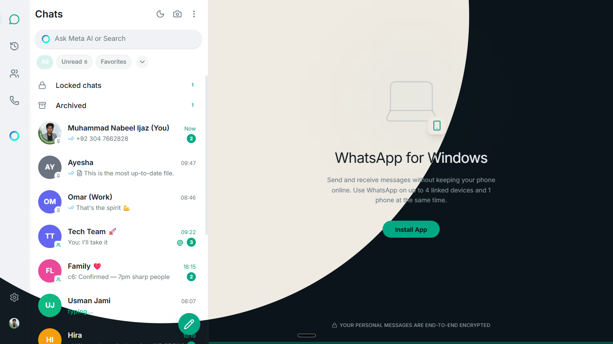&nbsp;&nbsp;
  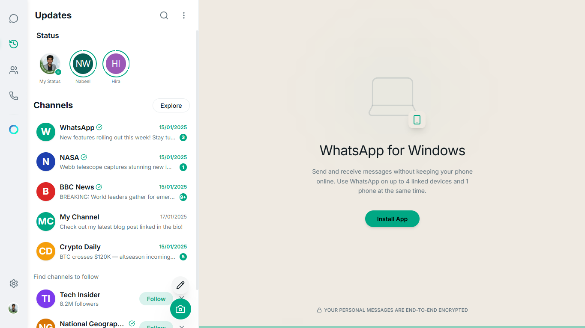&nbsp;&nbsp;
  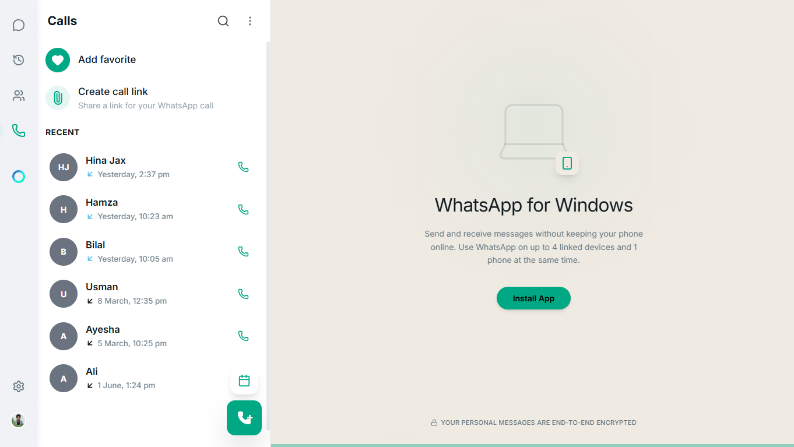
</p>
<p align="center">
  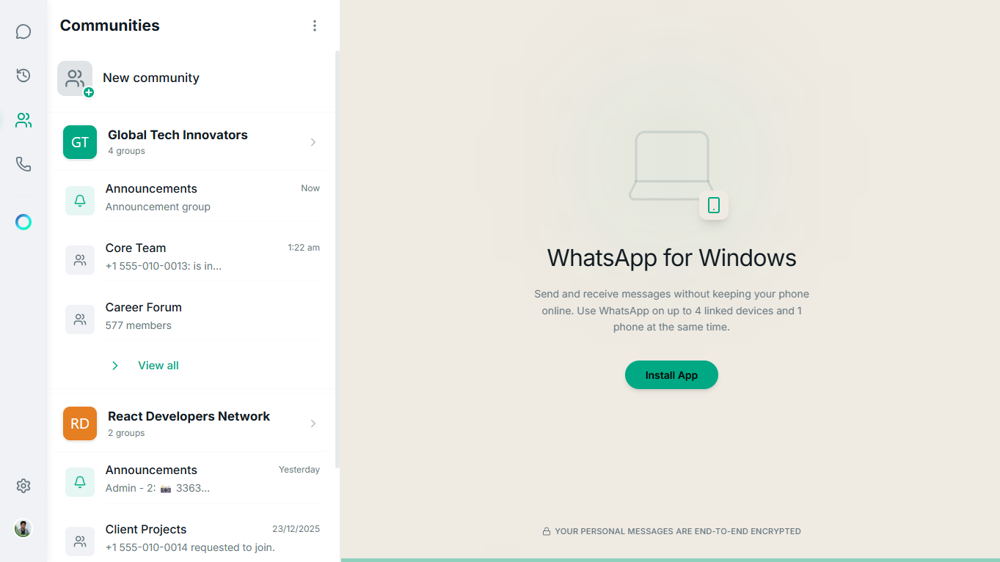&nbsp;&nbsp;
  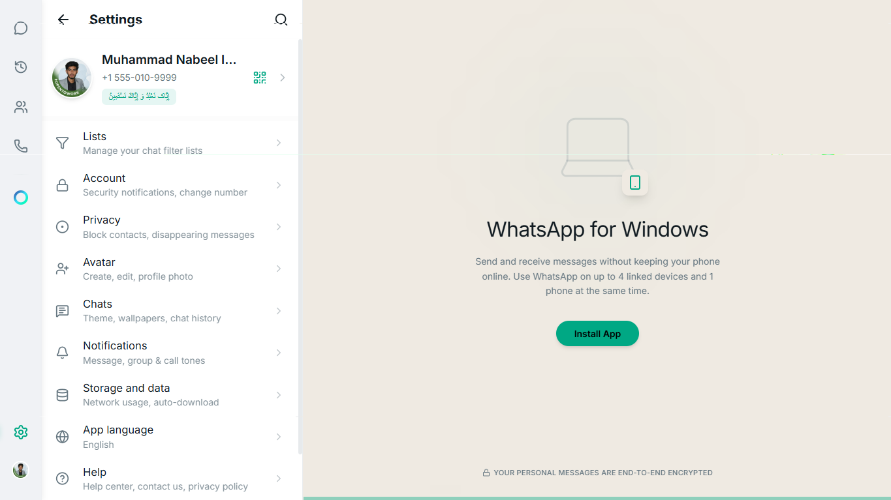&nbsp;&nbsp;
  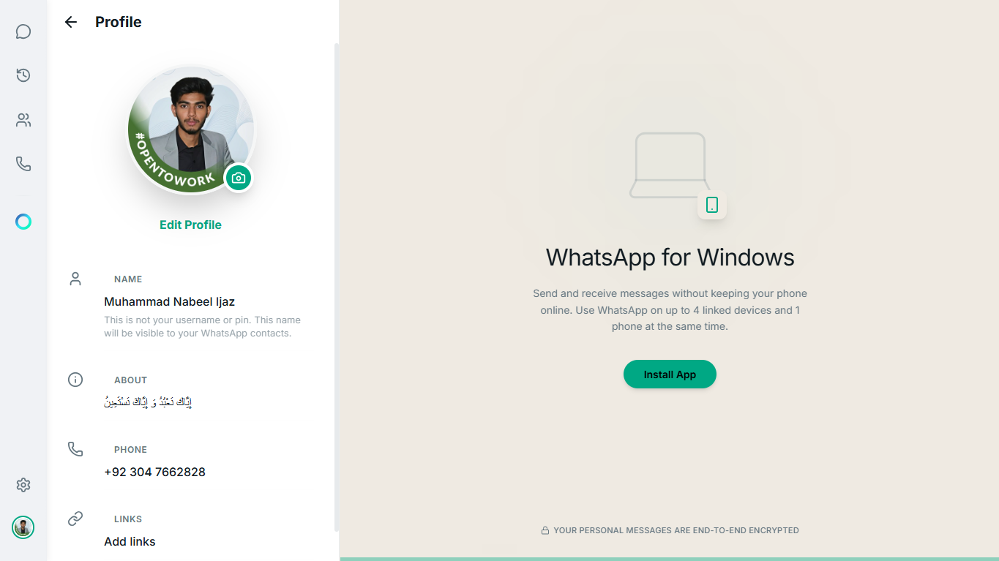
</p>
</details>

### <u>Getting Started</u>

### Prerequisites
- Node.js 20+ and npm

### Installation

```bash
# Clone the repository
git clone https://github.com/MuhammadNabeelIjaz/WhatsApp-UI-Clone.git
cd WhatsApp-UI-Clone

# Install dependencies
npm install

# Copy environment variables
cp .env.example .env
```

### Running locally

```bash
npm run dev
```

Open the URL Vite prints (usually `http://localhost:5173`).

### Building for production

```bash
npm run build
npm run preview   # preview the production build locally
```

### <u>Project Structure</u>

```
src/
├── app/            # App shell: layouts, navigation, context providers (theme, language)
├── core/           # Redux Toolkit store (9 slices), API/service layer, mock data, theme, constants
├── features/       # calls · chat · community · profile · settings · status — each owns its components, hooks, pages, services
├── i18n/           # Locale files (en, ar, de, es, fr, ur) and i18n config
├── shared/         # Shared UI library, hooks, types, constants used across features
└── assets/         # Images, fonts, sounds
```

The codebase follows a **feature-based architecture** — each domain (chat, calls, status,
community, settings) owns its own components, hooks, pages and services, with shared
building blocks kept under `core/` and `shared/`.

<details>
<summary><strong>📁 Full file tree — every file (97 directories, 338 files)</strong></summary>

```
.
|-- docs
|   `-- banner.svg
|-- public
|   |-- icon-192.png
|   |-- icon-512.png
|   |-- manifest.json
|   `-- sw.js
|-- src
|   |-- app
|   |   |-- layouts
|   |   |   |-- sidebars
|   |   |   |   |-- MainSidebar.jsx
|   |   |   |   |-- PrimarySidebar.jsx
|   |   |   |   `-- SecondarySidebar.jsx
|   |   |   `-- MainLayout.jsx
|   |   |-- navigation
|   |   |   `-- AppNavigator.jsx
|   |   |-- providers
|   |   |   |-- LanguageContext.jsx
|   |   |   `-- ThemeContext.jsx
|   |   `-- App.jsx
|   |-- assets
|   |   |-- fonts
|   |   |-- images
|   |   `-- sounds
|   |-- context
|   |   `-- LanguageContext.jsx   # ⚠ orphaned — no importers found; canonical is app/providers/LanguageContext.jsx
|   |-- core
|   |   |-- api
|   |   |   |-- callsService.js
|   |   |   |-- chatService.js
|   |   |   |-- communityService.js
|   |   |   |-- contactService.js
|   |   |   |-- index.js
|   |   |   `-- statusService.js
|   |   |-- constants
|   |   |   |-- icons.js
|   |   |   |-- index.js
|   |   |   `-- routes.js
|   |   |-- data
|   |   |   |-- channels.js
|   |   |   |-- chats.js
|   |   |   |-- communities.js
|   |   |   |-- contacts.js
|   |   |   |-- messages.js
|   |   |   `-- statuses.js
|   |   |-- store
|   |   |   |-- slices
|   |   |   |   |-- callsSlice.js
|   |   |   |   |-- channelCommunitySlice.js
|   |   |   |   |-- channelSlice.js
|   |   |   |   |-- chatSlice.js
|   |   |   |   |-- communitySlice.js
|   |   |   |   |-- contactSlice.js
|   |   |   |   |-- linkedDevicesSlice.js
|   |   |   |   |-- settingsSlice.js
|   |   |   |   |-- settingsUiSlice.js
|   |   |   |   |-- statusSlice.js
|   |   |   |   `-- uiSlice.js
|   |   |   |-- hooks.js
|   |   |   |-- index.js
|   |   |   `-- store.js
|   |   |-- theme
|   |   |   |-- colors.js
|   |   |   `-- fonts.js
|   |   `-- utils
|   |       |-- helpers.js
|   |       |-- logger.js
|   |       |-- notificationService.js
|   |       `-- rtl.js
|   |-- features
|   |   |-- calls
|   |   |   |-- components
|   |   |   |   |-- AddFavoriteHub.jsx
|   |   |   |   |-- CallDialerButton.jsx
|   |   |   |   |-- CallHistoryItem.jsx
|   |   |   |   |-- CallKeypad.jsx
|   |   |   |   |-- CreateCallLinkScreen.jsx
|   |   |   |   |-- DatePickerModal.jsx
|   |   |   |   |-- DynamicCallGrid.jsx
|   |   |   |   |-- FavoriteContactItem.jsx
|   |   |   |   |-- NewContactScreen.jsx   # ⚠ legacy shim — no importers found; canonical is shared/ui/contact/NewContactScreen.jsx
|   |   |   |   |-- ScheduleCallScreen.jsx
|   |   |   |   |-- ScheduleModal.jsx
|   |   |   |   |-- ScheduledCallsScreen.jsx
|   |   |   |   `-- TimePickerModal.jsx
|   |   |   |-- hooks
|   |   |   |   |-- useActiveCall.js
|   |   |   |   `-- useCallsFilter.js
|   |   |   |-- pages
|   |   |   |   |-- ActiveCallScreen.jsx
|   |   |   |   |-- CallInfoScreen.jsx
|   |   |   |   `-- CallsScreen.jsx
|   |   |   |-- services
|   |   |   |   `-- callsService.js
|   |   |   `-- index.js
|   |   |-- chat
|   |   |   |-- components
|   |   |   |   |-- bubbles
|   |   |   |   |   |-- AudioBubble.jsx
|   |   |   |   |   |-- CallBubble.jsx
|   |   |   |   |   |-- ContactBubble.jsx
|   |   |   |   |   |-- EventBubble.jsx
|   |   |   |   |   |-- EventCreation.jsx
|   |   |   |   |   |-- ImageBubble.jsx
|   |   |   |   |   |-- LocationBubble.jsx
|   |   |   |   |   |-- PollBubble.jsx
|   |   |   |   |   |-- PollCreation.jsx
|   |   |   |   |   |-- ReplyBubble.jsx
|   |   |   |   |   |-- TextBubble.jsx
|   |   |   |   |   `-- VoiceBubble.jsx
|   |   |   |   |-- panels
|   |   |   |   |   |-- ArchivedView.jsx
|   |   |   |   |   |-- BroadcastsView.jsx
|   |   |   |   |   |-- EditDeviceScreen.jsx
|   |   |   |   |   |-- LinkedDevices.jsx
|   |   |   |   |   |-- LockedView.jsx
|   |   |   |   |   |-- NewCommunityModal.jsx   # ⚠ legacy shim — no importers found; canonical is features/community/components/NewCommunityModal.jsx
|   |   |   |   |   |-- NewListModal.jsx
|   |   |   |   |   |-- NewListScreen.jsx
|   |   |   |   |   |-- ProfileScreen.jsx   # ⚠ legacy shim — no importers found; canonical is features/profile/components/ProfileScreen.jsx
|   |   |   |   |   |-- ScanQRLinkScreen.jsx
|   |   |   |   |   `-- StarredMessages.jsx
|   |   |   |   |-- sidebar
|   |   |   |   |   |-- AddToListModal.jsx
|   |   |   |   |   |-- SidebarChatList.jsx
|   |   |   |   |   |-- SidebarFAB.jsx
|   |   |   |   |   |-- SidebarFilterChips.jsx
|   |   |   |   |   |-- SidebarHeader.jsx
|   |   |   |   |   |-- SidebarSearch.jsx
|   |   |   |   |   `-- index.js
|   |   |   |   |-- user-info
|   |   |   |   |   |-- BroadcastInfoPanel.jsx
|   |   |   |   |   |-- DMInfoPanel.jsx
|   |   |   |   |   |-- EditContactModal.jsx
|   |   |   |   |   |-- GroupInfoPanel.jsx
|   |   |   |   |   |-- InfoPanelModals.jsx
|   |   |   |   |   `-- InfoPanelShared.jsx
|   |   |   |   |-- AttachmentMenu.jsx
|   |   |   |   |-- CameraOverlay.jsx
|   |   |   |   |-- ChatContextMenu.jsx
|   |   |   |   |-- ChatInputBar.jsx
|   |   |   |   |-- ChatListItem.jsx
|   |   |   |   |-- ChatSearchBar.jsx
|   |   |   |   |-- ContactPickerSheet.jsx
|   |   |   |   |-- KeptMessagesScreen.jsx
|   |   |   |   |-- LocationPreviewSheet.jsx
|   |   |   |   |-- MainSidebar.jsx
|   |   |   |   |-- MediaLinksDocsPanel.jsx
|   |   |   |   |-- MessageBubble.jsx   # ⚠ dead code — no importers found (file itself is marked TODO: delete)
|   |   |   |   |-- MuteSheet.jsx
|   |   |   |   |-- ProfilePictureOverlay.jsx   # ⚠ legacy shim — no importers found; canonical is shared/ui/display/ProfilePictureOverlay.jsx
|   |   |   |   |-- ReactionPopup.jsx
|   |   |   |   |-- SelectionHeader.jsx
|   |   |   |   |-- SendToScreen.jsx
|   |   |   |   `-- SwipeableMessage.jsx
|   |   |   |-- hooks
|   |   |   |   |-- useChatFilter.js
|   |   |   |   `-- useChatSearch.js
|   |   |   |-- pages
|   |   |   |   |-- MediaGalleryScreen.jsx
|   |   |   |   |-- UserInfoPanel.jsx
|   |   |   |   `-- WelcomeScreen.jsx
|   |   |   |-- sub-features
|   |   |   |   |-- broadcast
|   |   |   |   |   |-- components
|   |   |   |   |   |   |-- BroadcastInfo.jsx
|   |   |   |   |   |   `-- BroadcastRecipientRow.jsx
|   |   |   |   |   |-- hooks
|   |   |   |   |   |   `-- useBroadcast.js
|   |   |   |   |   |-- services
|   |   |   |   |   |   `-- broadcastService.js
|   |   |   |   |   |-- NewBroadcastScreen.jsx
|   |   |   |   |   `-- index.js
|   |   |   |   |-- direct-chat
|   |   |   |   |   |-- components
|   |   |   |   |   |   |-- ChatDetailDialogs.jsx
|   |   |   |   |   |   |-- ChatDetailHeader.jsx
|   |   |   |   |   |   |-- DirectChatHeader.jsx   # ⚠ dead code — no importers found (file itself is marked as removed/duplicate)
|   |   |   |   |   |   `-- ForwardPicker.jsx
|   |   |   |   |   |-- hooks
|   |   |   |   |   |   |-- useChatDropdown.js
|   |   |   |   |   |   |-- useChatOverlays.js
|   |   |   |   |   |   `-- useDirectChat.js
|   |   |   |   |   |-- services
|   |   |   |   |   |   `-- directChatService.js
|   |   |   |   |   |-- ChatDetail.jsx
|   |   |   |   |   `-- index.js
|   |   |   |   |-- group-chat
|   |   |   |   |   |-- components
|   |   |   |   |   |   |-- GroupSettings.jsx
|   |   |   |   |   |   `-- MemberList.jsx
|   |   |   |   |   |-- hooks
|   |   |   |   |   |   `-- useGroupChat.js
|   |   |   |   |   |-- services
|   |   |   |   |   |   `-- groupService.js
|   |   |   |   |   |-- NewGroupScreen.jsx
|   |   |   |   |   |-- SelectContactScreen.jsx
|   |   |   |   |   |-- constants.js
|   |   |   |   |   `-- index.js
|   |   |   |   `-- index.js
|   |   |   `-- index.js
|   |   |-- community
|   |   |   |-- components
|   |   |   |   |-- sub-screens
|   |   |   |   |   |-- AddCommunityMembersScreen.jsx
|   |   |   |   |   |-- ChatHistoryScreen.jsx
|   |   |   |   |   |-- CommunitySettingsScreen.jsx
|   |   |   |   |   |-- EditCommunityScreen.jsx
|   |   |   |   |   `-- ManageGroupsScreen.jsx
|   |   |   |   |-- AnnouncementChatScreen.jsx
|   |   |   |   |-- CommunityDetailScreen.jsx
|   |   |   |   |-- CommunityLinkScreen.jsx
|   |   |   |   |-- CommunityQRScreen.jsx
|   |   |   |   `-- NewCommunityModal.jsx
|   |   |   |-- hooks
|   |   |   |   `-- useCommunityActions.js
|   |   |   |-- pages
|   |   |   |   |-- CommunitiesScreen.jsx
|   |   |   |   `-- CommunityInfoScreen.jsx
|   |   |   |-- services
|   |   |   |   `-- communityService.js
|   |   |   `-- index.js
|   |   |-- profile
|   |   |   |-- components
|   |   |   |   |-- AboutScreen.jsx
|   |   |   |   |-- LinksScreen.jsx
|   |   |   |   |-- NameScreen.jsx
|   |   |   |   `-- ProfileScreen.jsx
|   |   |   |-- hooks
|   |   |   |   `-- useProfileEdit.js
|   |   |   |-- services
|   |   |   |   `-- profileService.js
|   |   |   `-- index.js
|   |   |-- settings
|   |   |   |-- components
|   |   |   |   |-- account
|   |   |   |   |   |-- AdPreferences.jsx
|   |   |   |   |   |-- ChangeNumber.jsx
|   |   |   |   |   |-- DeleteAccount.jsx
|   |   |   |   |   |-- EmailAddressSettings.jsx
|   |   |   |   |   |-- PasskeysSettings.jsx
|   |   |   |   |   |-- RemoveAccount.jsx
|   |   |   |   |   |-- RequestAccountInfo.jsx
|   |   |   |   |   |-- SecuritySettings.jsx
|   |   |   |   |   `-- TwoStepVerification.jsx
|   |   |   |   |-- chats
|   |   |   |   |   |-- ChatColorPicker.jsx
|   |   |   |   |   |-- ChatThemeScreen.jsx
|   |   |   |   |   |-- VoiceMessageTranscripts.jsx
|   |   |   |   |   `-- WallpaperGrid.jsx
|   |   |   |   |-- language
|   |   |   |   |   |-- LanguageSettings.jsx   # ⚠ orphaned — no importers found; imports a non-existent '@hooks' alias
|   |   |   |   |   `-- LanguageSettingsRow.jsx   # ⚠ orphaned — no importers found; imports a non-existent '@hooks' alias
|   |   |   |   |-- privacy
|   |   |   |   |   |-- AboutPrivacy.jsx
|   |   |   |   |   |-- AdPreferences.jsx
|   |   |   |   |   |-- AppLock.jsx
|   |   |   |   |   |-- BlockedContacts.jsx
|   |   |   |   |   |-- CallsSettings.jsx
|   |   |   |   |   |-- ChatLock.jsx
|   |   |   |   |   |-- GroupsPrivacy.jsx
|   |   |   |   |   |-- LastSeenPrivacy.jsx
|   |   |   |   |   |-- LinksPrivacy.jsx
|   |   |   |   |   |-- LiveLocation.jsx
|   |   |   |   |   |-- MessageTimer.jsx
|   |   |   |   |   |-- ProfilePhotoPrivacy.jsx
|   |   |   |   |   `-- StatusPrivacy.jsx
|   |   |   |   |-- AccountSettingsScreen.jsx
|   |   |   |   |-- AvatarSettingsScreen.jsx
|   |   |   |   |-- ChatsSettingsScreen.jsx
|   |   |   |   |-- HelpSettingsScreen.jsx
|   |   |   |   |-- InviteSettingsScreen.jsx
|   |   |   |   |-- LanguageSettingsScreen.jsx
|   |   |   |   |-- ListsSettingsScreen.jsx
|   |   |   |   |-- NotificationsSettingsScreen.jsx
|   |   |   |   |-- PrivacySettingsScreen.jsx
|   |   |   |   |-- QRCodeScreen.jsx
|   |   |   |   `-- StorageSettingsScreen.jsx
|   |   |   |-- hooks
|   |   |   |   `-- useSettingsForm.js
|   |   |   |-- pages
|   |   |   |   `-- SettingsScreen.jsx
|   |   |   |-- services
|   |   |   |   `-- settingsService.js
|   |   |   `-- index.js
|   |   `-- status
|   |       |-- components
|   |       |   |-- ChannelHeader.jsx
|   |       |   |-- ChannelItem.jsx
|   |       |   |-- ChannelPostList.jsx
|   |       |   |-- ChannelSection.jsx
|   |       |   |-- MyStatusSection.jsx
|   |       |   |-- StatusCreator.jsx
|   |       |   |-- StatusList.jsx
|   |       |   |-- StatusPlayer.jsx
|   |       |   `-- StatusRing.jsx
|   |       |-- hooks
|   |       |   |-- useChannelSearch.js
|   |       |   `-- useStatusViewer.js
|   |       |-- pages
|   |       |   |-- ChannelInfoScreen.jsx
|   |       |   |-- CreateChannelScreen.jsx
|   |       |   |-- ExploreChannelsScreen.jsx
|   |       |   `-- StatusScreen.jsx
|   |       |-- services
|   |       |   `-- statusService.js
|   |       `-- index.js
|   |-- hooks
|   |   `-- useLanguage.js   # ⚠ orphaned — no importers found; canonical is shared/hooks/useLanguage.js
|   |-- i18n
|   |   |-- config
|   |   |   `-- index.js
|   |   `-- locales
|   |       |-- ar.js
|   |       |-- de.js
|   |       |-- en.js
|   |       |-- es.js
|   |       |-- fr.js
|   |       `-- ur.js
|   |-- shared
|   |   |-- constants
|   |   |   |-- appColors.js
|   |   |   |-- chatTypes.js
|   |   |   |-- index.js
|   |   |   |-- messageStatus.js
|   |   |   `-- privacyOptions.js
|   |   |-- hooks
|   |   |   |-- index.js
|   |   |   |-- useAvatarZoom.js
|   |   |   |-- useChatFilter.js   # ⚠ orphaned — not re-exported/imported; canonical is features/chat/hooks/useChatFilter.js
|   |   |   |-- useChatSearch.js   # ⚠ orphaned — not re-exported/imported; canonical is features/chat/hooks/useChatSearch.js
|   |   |   |-- useChipDrag.js
|   |   |   |-- useFakeLoading.js
|   |   |   |-- useIsDesktop.js
|   |   |   |-- useLanguage.js
|   |   |   |-- useLongPress.js
|   |   |   |-- useMessageSelection.js
|   |   |   |-- useOutsideClick.js
|   |   |   |-- usePermissions.js
|   |   |   |-- usePinnedMessages.js
|   |   |   |-- useResizable.js
|   |   |   |-- useScrollRestore.js
|   |   |   `-- useSearch.js
|   |   |-- types
|   |   |   |-- chat.js
|   |   |   |-- index.js
|   |   |   `-- store.js
|   |   |-- ui
|   |   |   |-- buttons
|   |   |   |   |-- Button.jsx
|   |   |   |   |-- IconButton.jsx
|   |   |   |   |-- ToggleSwitch.jsx
|   |   |   |   `-- index.js
|   |   |   |-- contact
|   |   |   |   `-- NewContactScreen.jsx
|   |   |   |-- display
|   |   |   |   |-- Avatar.jsx
|   |   |   |   |-- Badge.jsx
|   |   |   |   |-- EmptyState.jsx
|   |   |   |   |-- HighlightedText.jsx
|   |   |   |   |-- ImageViewer.jsx
|   |   |   |   |-- MetaAIIcon.jsx
|   |   |   |   |-- ProfilePictureOverlay.jsx
|   |   |   |   |-- SidebarTooltip.jsx
|   |   |   |   |-- SkeletonChatDetail.jsx
|   |   |   |   |-- SkeletonChatListItem.jsx
|   |   |   |   |-- Skeletons.jsx
|   |   |   |   `-- index.js
|   |   |   |-- feedback
|   |   |   |   |-- BottomSheet.jsx
|   |   |   |   |-- ConfirmDialog.jsx
|   |   |   |   |-- Spinner.jsx
|   |   |   |   |-- Toast.jsx
|   |   |   |   `-- index.js
|   |   |   |-- forms
|   |   |   |   |-- RadioOption.jsx
|   |   |   |   `-- index.js
|   |   |   |-- inputs
|   |   |   |   |-- CountryPicker.jsx
|   |   |   |   |-- SearchInput.jsx
|   |   |   |   |-- TextInput.jsx
|   |   |   |   |-- Textarea.jsx
|   |   |   |   `-- index.js
|   |   |   |-- language
|   |   |   |   `-- LanguageRow.jsx
|   |   |   |-- layout
|   |   |   |   |-- Divider.jsx
|   |   |   |   |-- ListItem.jsx
|   |   |   |   |-- ScreenHeader.jsx
|   |   |   |   `-- index.js
|   |   |   |-- list
|   |   |   |   |-- ContactRow.jsx
|   |   |   |   |-- SectionLabel.jsx
|   |   |   |   |-- SelectionCheckCircle.jsx
|   |   |   |   `-- index.js
|   |   |   |-- modals
|   |   |   |   |-- CenteredModal.jsx
|   |   |   |   |-- MenuButton.jsx
|   |   |   |   `-- index.js
|   |   |   |-- navigation
|   |   |   |   |-- NavButton.jsx
|   |   |   |   `-- index.js
|   |   |   |-- settings
|   |   |   |   |-- PickerModal.jsx
|   |   |   |   |-- SectionHeader.jsx
|   |   |   |   |-- SettingsRow.jsx
|   |   |   |   `-- index.js
|   |   |   |-- sheets
|   |   |   |   |-- ChooseListSheet.jsx
|   |   |   |   `-- index.js
|   |   |   |-- skeletons
|   |   |   |   |-- base.jsx
|   |   |   |   |-- calls.jsx
|   |   |   |   |-- channels.jsx
|   |   |   |   |-- chat.jsx
|   |   |   |   |-- community.jsx
|   |   |   |   |-- index.js
|   |   |   |   |-- settings.jsx
|   |   |   |   |-- shared.jsx
|   |   |   |   `-- status.jsx
|   |   |   `-- index.js
|   |   `-- index.js
|   |-- utils
|   |   `-- rtl.js
|   |-- index.css
|   `-- main.jsx
|-- README.md
|-- eslint.config.js
|-- index.html
|-- package-lock.json
|-- package.json
|-- tsconfig.json
`-- vite.config.js

97 directories, 338 files
```

Lines marked **⚠** were flagged while auditing the codebase against its own imports and
the `vite.config.js` path aliases: they're legacy duplicates or compatibility shims left
over from refactoring, with **zero importers found anywhere else in the codebase**. See
[Architecture Notes](#architecture-notes) below.

</details>

### <u>Architecture Notes</u>

- **State management** is fully on Redux Toolkit — nine slices (`ui`, `contacts`, `channels`,
  `communities`, `settings`, `chats`, `statuses`, `linkedDevices`, `calls`) cover the whole
  app; an earlier custom store kernel was migrated away and removed.
- **Service layer is backend-ready by design**: feature-level services (calls, community,
  profile, settings, status) currently resolve against local mock data via `Promise.resolve()`,
  written so they can be swapped for real API calls behind the same function signatures.
- **PWA support is install-only for now** — the service worker exists to satisfy install
  criteria (`install` / `activate` / an empty `fetch` listener) and doesn't cache anything yet.
- **13 legacy files with zero importers** are flagged with ⚠ in the full file tree above —
  duplicate/shim versions of `LanguageContext`, `useLanguage`, `useChatFilter`, `useChatSearch`,
  `NewContactScreen`, `NewCommunityModal`, `ProfileScreen`, `ProfilePictureOverlay`, and the
  two `language/` settings components. Each was superseded by a canonical version elsewhere
  (often with a comment in the old file pointing to the replacement) and confirmed against
  both the import graph and the `vite.config.js` aliases. Safe cleanup candidates.


### <u>Contributing</u>

Contributions are welcome. To propose a change:

1. Fork the repository
2. Create a feature branch (`git checkout -b feature/your-feature`)
3. Commit your changes with a clear message
4. Open a pull request describing what changed and why

### <u>Disclaimer</u>

This project is an independent, fan-made clone built for learning and portfolio purposes.
It is **not affiliated with, endorsed by, or connected to WhatsApp or Meta Platforms, Inc.**
"WhatsApp" is a trademark of Meta Platforms, Inc.

### <u>License</u>
This project is licensed under the MIT License. See the [LICENSE](LICENSE) file for details.

### <u>Author</u>

**Muhammad Nabeel Ijaz**
